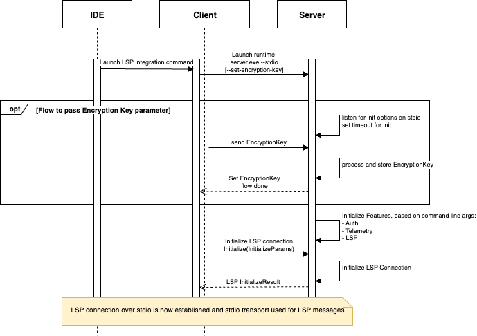

# AWS Language Server Runtimes

AWS Language Server Runtimes is a JSON-RPC based protocol for interactions between servers and clients (typically embedded in development tools). The JSON-RPC protocol follows the version utilized in the [LSP Specification - 3.17](https://microsoft.github.io/language-server-protocol/specifications/lsp/3.17/specification/), for compatibility. A subset of LSP version 3.17 is supported (see [LSP](README.md#lsp)) plus an additional set of request and response types (see [Features](README.md#features)).

Language Server Runtimes supports a number of host environments that each have their own underlying transport mechanisms and environment considerations, which must also support JSON-RPC communication. To see the differences between host environments, see [Runtime Host Environments](README.md#runtime-host-environments).

### Terminology

The server runtime will provide “Features” which refers to the AWS Language Server Runtimes core feature (eg. LSP, Logging, etc). These features will be injected on top of the Server business logic implementation at build time. [Capabilities](https://microsoft.github.io/language-server-protocol/specifications/lsp/3.17/specification/#capabilities) are a set of language features provided by an LSP.

### Server initialization flow and features negotiation

AWS Language Server Runtimes uses LSP abstracts to create a JSON-RPC connection between client and server. We use the `Initialize` LSP lifecycle method to provide initialization options to the server.

Features will be instantiated and configured during execution of the `Initialize` flow of the main connection.

Client will send the `Initialize` LSP request with custom options to configure features in the optional [`InitializeParams.initializationOptions`](https://microsoft.github.io/language-server-protocol/specifications/lsp/3.17/specification/#initializeParams) property. The configuration passed here will influence implementation details of different capabilities defined below. `initializationOptions` can be processed by the runtime and used to initialize features according to their implementation details. For information on which options are used, please see Initilization sections in each feature.

## Features

### LSP

The server runtime implementation acts as a proxy for LSP methods, which means it supports all LSP methods. In addition to that, it can extend the LSP method to support custom capabilities.

#### Feature Specification

| Method | Support | Notes | 
| ------ | ------- | ----- |
| onInlineCompletion | Yes | Provide list of inline completion suggestions from the Server |
| onExecuteCommand | Yes | Executes a custom command provided by the Server. Servers are advised to document custom commands they support in the package README. For a consistent experience, naming of the commands should consist of the main Server name and purpose of the command combined with `/` (forward slash) and written in camelCase format. Eg. `/helloWorld/logError` |

##### LSP Extensions
| Method Name | Method | Params | Method Type | Response Type | Notes |
| ------------| ------ | ------ | ----------- | ------------- | ----- |
| onInlineCompletionWithReferences | `aws/textDocument/inlineCompletionWithReferences` | `InlineCompletionWithReferencesParams` | [Request](https://microsoft.github.io/language-server-protocol/specifications/lsp/3.17/specification/#requestMessage) | `InlineCompletionListWithReferences` | Provides list of inline completion suggestions from the Server with references for each of its suggestion |
| onLogInlineCompletionSessionResults | `aws/logInlineCompletionSessionResults` | `LogInlineCompletionSessionResultsParams` | [Notification](https://microsoft.github.io/language-server-protocol/specifications/lsp/3.17/specification/#notificationMessage) | n/a | Logs the results from inline completion suggestions from the Server |

### Auth

The runtime supports two types of credentials: [IAM credentials](https://docs.aws.amazon.com/AWSJavaScriptSDK/latest/AWS/Credentials.html) and Bearer tokens (e.g. Builder ID). These credentials should be available to destinations in plaintext. 

```ts
// IAM Credentials data
export interface IamCredentials {
    accessKeyId: string
    secretAccessKey: string
    sessionToken?: string
}

// Bearer Token data
export interface BearerCredentials {
    token: string
}
```

Destinations are responsible for managing credentials state, refreshing and updating them on the runtime when their state changes. 

#### Initialization
The runtimes by default support authentication with both types of credentials, without the need of a prior agreement or handshake with the client. If the client supports a specific type of credentials, the corresponding LSP `update` method can be called directly. For cases when passing plaintext credentials is not suitable (e.g. standalone runtimes), they can be encrypted before being sent to the server (see [Encryption](README.md#encryption)).

#### Feature Specification
The following table outlines custom LSP methods are supported by servers for authentication:

| Description |	Method | Params | Method type | Response Type |
| ----------- | ------ | ------ | ----------- | ------------- |
| Send IAM Credentials | `aws/credentials/iam/update` | `UpdateCredentialsPayload` | [Request](https://microsoft.github.io/language-server-protocol/specifications/lsp/3.17/specification/#requestMessage) | [ResponseMessage](https://microsoft.github.io/language-server-protocol/specifications/lsp/3.17/specification/#responseMessage) |
| Send Bearer token |	`aws/credentials/token/update` | `UpdateCredentialsPayload` |	[Request](https://microsoft.github.io/language-server-protocol/specifications/lsp/3.17/specification/#requestMessage)	| [ResponseMessage](https://microsoft.github.io/language-server-protocol/specifications/lsp/3.17/specification/#responseMessage) |
| Delete IAM credentials | `aws/credentials/iam/delete` | n/a | [Notification](https://microsoft.github.io/language-server-protocol/specifications/lsp/3.17/specification/#notificationMessage) | n/a |
| Delete bearer token |	`aws/credentials/token/delete` | n/a | [Notification](https://microsoft.github.io/language-server-protocol/specifications/lsp/3.17/specification/#notificationMessage) | n/a |

```ts
export type Credentials = IamCredentials | BearerCredentials

// Credentials provided to the server by the server's host
export interface UpdateCredentialsPayload {
    // Plaintext IamCredentials/BearerCredentials or JSON blob of encrypted credentials
    data: string | Credentials
    // If the payload is encrypted
    // Defaults to false if undefined or null
    encrypted?: boolean
}
```

##### Get Connection Metadata

Server Auth feature supports storing extra Auth connection data in the server.
Get connection metadata is request that server sends to client in order to obtain new connection information.
Server expects client to provide metadata specified in `ConnectionMetadata` interface.

| Description |	Method | Params | Method type | Response Type |
| ----------- | ------ | ------ | ----------- | ------------- |
| Get Connection Metadata | `aws/credentials/getConnectionMetadata` | n/a | [Request](https://microsoft.github.io/language-server-protocol/specifications/lsp/3.17/specification/#requestMessage) | `ConnectionMetadata` |

```ts
export interface ConnectionMetadata {
    sso?: SsoProfileData;
}

export interface SsoProfileData {
    startUrl?: string;
}
```

### Telemetry

#### Initialization
The runtimes by default supports the telemetry feature, allowing servers to send metrics to destinations. Additional option to disable this feature during initialization as well as during an ongoing session is currently in plan.

#### Feature Specification
The telemetry notification is sent from the server to the client to ask the client to log a telemetry event. AWS Runtimes using Telemetry feature will send metric events with default LSP telemetry notification with specified payload interface. Telemetry notifications are specified as follow:

| Description |	Method | Params | Method type | Response Type |
| ----------- | ------ | ------ | ----------- | ------------- |
| Send telemetry event | `telemetry/event` | `MetricEvent` | [Notification](https://microsoft.github.io/language-server-protocol/specifications/lsp/3.17/specification/#notificationMessage) | n/a |

```ts
export type MetricEvent = {
    name: string;
    data?: any;
    result?: ResultType;
    errorData?: ErrorData;
};
```

### Logging

Design TBD

#### Initialization
TBD

#### Feature Specification
TBD


## Runtime Host Environments

Servers typically run as processes or web workers. Details are provided below on how to initialize each type of server runtime.

### Standalone Server

Features and modes can be communicated to the server at startup through command line arguments. Implementation detail of the Standalone Server is that it can be started with a special `--set-credentials-encryption-key` argument to enter special flow for accepting encryption options as an argument before starting the main LSP connection.

```
server-standalone.exe

# Server options
[--stdio] - uses stdio as the communication channel (https://microsoft.github.io/language-server-protocol/specifications/lsp/3.17/specification/#implementationConsiderations)
[--set-credentials-encryption-key] - signal to server to invoke a flow for accepting encryption key before starting main server initialisation.

[--version] - server returns its version

...
# We can define extra options, e.g. extra transport modes to provide compatibility with different clients are also possible.
[--pipe] - use pipes (Windows) or socket files (Linux, Mac) as the communication channel. The pipe / socket file name is passed as the next arg or with —pipe=.
[--socket] - uses a socket as the communication channel. The port is passed as next arg or with —port=.
[--node-ipc] - use node IPC communication between the client and the server. This is only supported if both client and server run under node.
```

Server startup diagram:



#### Encryption
Runtimes support the passing of encrypted credentials over LSP with stdio as transport. Encryption options must be sent to the runtime over stdin before the LSP initalization starts. Currently, runtimes support AES symmetric encryption with 256 bit keys.  

The following steps outline how to enable encrypted credentials:

1. Create a random 256 bit (32 byte) encryption key. 
2. Pass the `--set-credentials-encryption-key` command line argument to the server process at launch. This will signal to the server that the client wants to enable encryption and will wait for the encryption options during the next 5 seconds.
3. Immediately send a JSON blob over `stdin` with the information in the script below, followed by the new line `/n` character, which will signal the end of transmission to the runtime. If LSP initialization continues, encryption options have been validated and saved. If the client fails to send encryption options during the first 5 seconds or the JSON object is invalid, the process will exit with status code 10. 

```json
{
   "version" : "1.0", 
   "key" : "<base64 encoded encryption key>",
   "mode" : "JWT" 
}
```

4. After LSP initialization is complete, destinations should send credentials over LSP and are responsible for keeping them updated. 

To send encrypted credentials, the `UpdateCredentialsPayload` parameters should be sent over the corresponding `aws/credentials/${type}/update` method.

`UpdateCredentialsPayload` specification: 

1. **- encrypted**: set to `true` ;
2. **- data**: string value representing the encrypted [JWT](https://www.rfc-editor.org/rfc/rfc7519) token. Encryption must be done with `{ alg: 'dir', enc: 'A256GCM' }` parameters. The payload to be encrypted must contain data field with the credentials. 
3. Clients can set [nbf/exp](https://datatracker.ietf.org/doc/html/rfc7519#section-4.1.4) claims on the JWT token, which will be validated on the runtime side. A `clockTolerance` of 60 seconds is allowed when verifying the claims.

```json
// JWT payload to be encrypted
{
   "data": <credentials> 
}
```

### WebWorker

TBD

## Security

See [CONTRIBUTING](CONTRIBUTING.md#security-issue-notifications) for more information.

## License

This project is licensed under the Apache-2.0 License.

