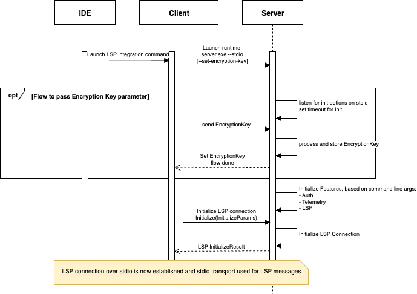

# Language Server Runtimes

Language Server Runtimes is a JSON-RPC based protocol for interactions between servers and clients (typically embedded in development tools). The JSON-RPC protocol follows the version utilized in the [LSP Specification - 3.17](https://microsoft.github.io/language-server-protocol/specifications/lsp/3.17/specification/), for compatibility. A subset of LSP version 3.17 is supported (see [LSP](README.md#lsp)) plus an additional set of request and response types (see [Features](README.md#features)).

Language Server Runtimes supports a number of host environments that each have their own underlying transport mechanisms and environment considerations, which must also support JSON-RPC communication. To see the differences between host environments, see [Runtime Host Environments](README.md#runtime-host-environments).

## Terminology

The server runtime will provide “Features” which refers to the Language Server Runtimes core feature (eg. LSP, Logging, etc). These features will be injected on top of the Server business logic implementation at build time. [Capabilities](https://microsoft.github.io/language-server-protocol/specifications/lsp/3.17/specification/#capabilities) are a set of language features provided by an LSP.

## Project structure

The project source code is split into next directories:

-   `/src`: This directory contains all the source code of the project.
    -   `/protocol`: JSON-RPC-based Runtime protocol implementation in Typescript, which defines the communication between Runtime and Runtime Clients (e.g. AWS Toolkit extension).
    -   `/runtimes`: implementation of several runtimes (standalone, webworker) and features, that are exposed to Runtime Servers developed by Server implementors.
    -   `/server-interface`: defines interfaces of features, that Runtime provides to Runtime Servers implementors.
    -   `/testing`: testing helper for Server implementors.

## Features

### LSP

The server runtime implementation acts as a proxy for LSP methods, which means it supports all LSP methods. In addition to that, it can extend the LSP method to support custom capabilities.

#### Feature Specification

| Method             | Support | Notes                                                                                                                                 |
| ------------------ | ------- | ------------------------------------------------------------------------------------------------------------------------------------- |
| onInlineCompletion | Yes     | Provide list of inline completion suggestions from the Server                                                                         |
| onExecuteCommand   | Yes     | Executes a custom command provided by the Server. Servers are advised to document custom commands they support in the package README. |

##### LSP Workspace

| Description                          | Method                            | Params                         | Method type                                                                                                                     | Response Type   |
| ------------------------------------ | --------------------------------- | ------------------------------ | ------------------------------------------------------------------------------------------------------------------------------- | --------------- |
| Request to select workspace item (folder, file) with the selected items returned | `aws/selectWorkspaceItem`         | `SelectWorkspaceItemParams`                   | [Request](https://microsoft.github.io/language-server-protocol/specifications/lsp/3.17/specification/#requestMessage) Server to Client           | `SelectWorkspaceItemResult`    |
| Sent notification to open file differences for the new file content. Supports new, updated or removed files. | `aws/openFileDiff`                | `OpenFileDiffParams`                | [Notification](https://microsoft.github.io/language-server-protocol/specifications/lsp/3.17/specification/#notificationMessage) Server to Client          | n/a |

##### LSP Extensions

| Method Name                         | Method                                            | Params                                    | Method Type                                                                                                                     | Response Type                        | Notes                                                                                                     |
| ----------------------------------- | ------------------------------------------------- | ----------------------------------------- | ------------------------------------------------------------------------------------------------------------------------------- | ------------------------------------ | --------------------------------------------------------------------------------------------------------- |
| getConfigurationFromServer          | `aws/getConfigurationFromServer`                  | `GetConfigurationFromServerParams`        | [Request](https://microsoft.github.io/language-server-protocol/specifications/lsp/3.17/specification/#requestMessage)           | `LSPAny`                             | Retrieves configuration from the server for a specified section                                           |
| onInlineCompletionWithReferences    | `aws/textDocument/inlineCompletionWithReferences` | `InlineCompletionWithReferencesParams`    | [Request](https://microsoft.github.io/language-server-protocol/specifications/lsp/3.17/specification/#requestMessage)           | `InlineCompletionListWithReferences` | Provides list of inline completion suggestions from the Server with references for each of its suggestion |
| onLogInlineCompletionSessionResults | `aws/logInlineCompletionSessionResults`           | `LogInlineCompletionSessionResultsParams` | [Notification](https://microsoft.github.io/language-server-protocol/specifications/lsp/3.17/specification/#notificationMessage) | n/a                                  | Logs the results from inline completion suggestions from the Server                                       |

### Auth

The runtime supports two types of credentials: [IAM credentials](https://docs.aws.amazon.com/AWSJavaScriptSDK/latest/AWS/Credentials.html) and Bearer tokens (e.g. Builder ID). These credentials should be available to destinations in plaintext.

```ts
// IAM Credentials data
export interface IamCredentials {
    accessKeyId: string
    secretAccessKey: string
    sessionToken?: string
}

// Bearer Token data
export interface BearerCredentials {
    token: string
}
```

Destinations are responsible for managing credentials state, refreshing and updating them on the runtime when their state changes.

#### Initialization

The runtimes by default support authentication with both types of credentials, without the need of a prior agreement or handshake with the client. If the client supports a specific type of credentials, the corresponding LSP `update` method can be called directly. For cases when passing plaintext credentials is not suitable (e.g. standalone runtimes), they can be encrypted before being sent to the server (see [Encryption](README.md#encryption)).

#### Feature Specification

The following table outlines custom LSP methods are supported by servers for authentication:

| Description            | Method                         | Params                     | Method type                                                                                                                     | Response Type                                                                                                                  |
| ---------------------- | ------------------------------ | -------------------------- | ------------------------------------------------------------------------------------------------------------------------------- | ------------------------------------------------------------------------------------------------------------------------------ |
| Send IAM Credentials   | `aws/credentials/iam/update`   | `UpdateCredentialsPayload` | [Request](https://microsoft.github.io/language-server-protocol/specifications/lsp/3.17/specification/#requestMessage)           | [ResponseMessage](https://microsoft.github.io/language-server-protocol/specifications/lsp/3.17/specification/#responseMessage) |
| Send Bearer token      | `aws/credentials/token/update` | `UpdateCredentialsPayload` | [Request](https://microsoft.github.io/language-server-protocol/specifications/lsp/3.17/specification/#requestMessage)           | [ResponseMessage](https://microsoft.github.io/language-server-protocol/specifications/lsp/3.17/specification/#responseMessage) |
| Delete IAM credentials | `aws/credentials/iam/delete`   | n/a                        | [Notification](https://microsoft.github.io/language-server-protocol/specifications/lsp/3.17/specification/#notificationMessage) | n/a                                                                                                                            |
| Delete bearer token    | `aws/credentials/token/delete` | n/a                        | [Notification](https://microsoft.github.io/language-server-protocol/specifications/lsp/3.17/specification/#notificationMessage) | n/a                                                                                                                            |

```ts
export type Credentials = IamCredentials | BearerCredentials

// Credentials provided to the server by the server's host
export interface UpdateCredentialsPayload {
    // Plaintext IamCredentials/BearerCredentials or JSON blob of encrypted credentials
    data: string | Credentials
    // If the payload is encrypted
    // Defaults to false if undefined or null
    encrypted?: boolean
}
```

##### Get Connection Metadata

Server Auth feature supports storing extra Auth connection data in the server.
Get connection metadata is request that server sends to client in order to obtain new connection information.
Server expects client to provide metadata specified in `ConnectionMetadata` interface.

| Description             | Method                                  | Params | Method type                                                                                                           | Response Type        |
| ----------------------- | --------------------------------------- | ------ | --------------------------------------------------------------------------------------------------------------------- | -------------------- |
| Get Connection Metadata | `aws/credentials/getConnectionMetadata` | n/a    | [Request](https://microsoft.github.io/language-server-protocol/specifications/lsp/3.17/specification/#requestMessage) | `ConnectionMetadata` |

```ts
export interface ConnectionMetadata {
    sso?: SsoProfileData
}

export interface SsoProfileData {
    startUrl?: string
}
```

### Telemetry

#### Initialization

The runtimes by default supports the telemetry feature, allowing servers to send metrics to destinations. Additional option to disable this feature during initialization as well as during an ongoing session is currently in plan.

#### Feature Specification

The telemetry notification is sent from the server to the client to ask the client to log a telemetry event. AWS Runtimes using Telemetry feature will send metric events with default LSP telemetry notification with specified payload interface. Telemetry notifications are specified as follow:

| Description          | Method            | Params        | Method type                                                                                                                     | Response Type |
| -------------------- | ----------------- | ------------- | ------------------------------------------------------------------------------------------------------------------------------- | ------------- |
| Send telemetry event | `telemetry/event` | `MetricEvent` | [Notification](https://microsoft.github.io/language-server-protocol/specifications/lsp/3.17/specification/#notificationMessage) | n/a           |

```ts
export type MetricEvent = {
    name: string
    data?: any
    result?: ResultType
    errorData?: ErrorData
}
```

### Logging

Design TBD

#### Initialization

The runtimes by default supports the logging feature, allowing servers to output logs varied by different log levels. 

#### Feature Specification

The log level to be set in the runtime for logging can be decided by the client as part of initialize request, which is the first
request initiated by client to the LSP server. The log level can be updated dynamically even after server start by triggering `workspace/didChangeConfiguration` 
notification from the client - which prompts the runtime to fetch the new log level to be set from the client through LSP `getConfigurations` request. 
1. Params in the initialize request: `InitializeParams.initializationOptions.logLevel`
2. Configuration request params for requesting log level from runtimes to client: ``{section: "aws.logLevel"}`` 


### Chat

The runtime defines Chat interface that allow runtime server implementors to define handlers for chat events to enable conversational experiences. Chat data types are mostly modeled after [mynah-ui](https://github.com/aws/mynah-ui), an event driven UI library designed for chat experiences. `mynah-ui` is the suggested UI library to be used on the destination. However the Chat interface is generic enough to be compatible with other UI approaches

#### Initialization

The runtime supports chat by default

#### Feature Specification

| Description                          | Method                            | Params                         | Method type                                                                                                                     | Response Type   |
| ------------------------------------ | --------------------------------- | ------------------------------ | ------------------------------------------------------------------------------------------------------------------------------- | --------------- |
| Send chat prompt. Supports streaming chat message content to client. Response is optional - this event can be used to only trigger chat prompt request and then `aws/chat/sendChatUpdate` can be used to send chat updates asyncronously. | `aws/chat/sendChatPrompt`         | `ChatParams`                   | [Request](https://microsoft.github.io/language-server-protocol/specifications/lsp/3.17/specification/#requestMessage) Client to Server          | `ChatResult`    |
| End conversation                     | `aws/chat/endChat`                | `EndChatParams`                | [Request](https://microsoft.github.io/language-server-protocol/specifications/lsp/3.17/specification/#requestMessage) Client to Server          | `EndChatResult` |
| Send chat quick action. Response is optional - this event can be used to only trigger chat quick action request and then `aws/chat/sendChatUpdate` can be used to send chat updates asyncronously. | `aws/chat/sendChatQuickAction`    | `QuickActionParams`            | [Request](https://microsoft.github.io/language-server-protocol/specifications/lsp/3.17/specification/#requestMessage) Client to Server          | `ChatResult`    |
| Send chat UI ready event             | `aws/chat/ready`                  | n/a                            | [Notification](https://microsoft.github.io/language-server-protocol/specifications/lsp/3.17/specification/#notificationMessage) Client to Server | n/a             |
| Send chat vote event                 | `aws/chat/vote`                   | `VoteParams`                   | [Notification](https://microsoft.github.io/language-server-protocol/specifications/lsp/3.17/specification/#notificationMessage) Client to Server | n/a             |
| Send chat feedback event             | `aws/chat/feedback`               | `FeedbackParams`               | [Notification](https://microsoft.github.io/language-server-protocol/specifications/lsp/3.17/specification/#notificationMessage) Client to Server | n/a             |
| Send tab add event                   | `aws/chat/tabAdd`                 | `TabAddParams`                 | [Notification](https://microsoft.github.io/language-server-protocol/specifications/lsp/3.17/specification/#notificationMessage) Client to Server | n/a             |
| Send active tab change event         | `aws/chat/tabChange`              | `TabChangeParams`              | [Notification](https://microsoft.github.io/language-server-protocol/specifications/lsp/3.17/specification/#notificationMessage) Client to Server | n/a             |
| Send tab remove event                | `aws/chat/tabRemove`              | `TabRemoveParams`              | [Notification](https://microsoft.github.io/language-server-protocol/specifications/lsp/3.17/specification/#notificationMessage) Client to Server | n/a             |
| Send insert to cursor position event | `aws/chat/insertToCursorPosition` | `InsertToCursorPositionParams` | [Notification](https://microsoft.github.io/language-server-protocol/specifications/lsp/3.17/specification/#notificationMessage) Client to Server | n/a             |
| Send copy code to clipboard event    | `aws/chat/copyCodeToClipboard`    | `CopyCodeToClipboardParams`    | [Notification](https://microsoft.github.io/language-server-protocol/specifications/lsp/3.17/specification/#notificationMessage) Client to Server | n/a             |
| Send link click event                | `aws/chat/linkClick`              | `LinkClickParams`              | [Notification](https://microsoft.github.io/language-server-protocol/specifications/lsp/3.17/specification/#notificationMessage) Client to Server | n/a             |
| Send info link click event           | `aws/chat/infoLinkClick`          | `InfoLinkClickParams`          | [Notification](https://microsoft.github.io/language-server-protocol/specifications/lsp/3.17/specification/#notificationMessage) Client to Server | n/a             |
| Send source link click event         | `aws/chat/sourceLinkClick`        | `SourceLinkClickParams`        | [Notification](https://microsoft.github.io/language-server-protocol/specifications/lsp/3.17/specification/#notificationMessage) Client to Server | n/a             |
| Send followup chat item click event  | `aws/chat/followUpClick`          | `FollowUpClickParams`          | [Notification](https://microsoft.github.io/language-server-protocol/specifications/lsp/3.17/specification/#notificationMessage) Client to Server | n/a             |
| Send request to open existing tab, if `tabId` is passed or create and open new tab, if `tabId` is not passed. For the new tab, it's also possible to set tab state and content.  | `aws/chat/openTab`          | `OpenTabParams`          | [Request](https://microsoft.github.io/language-server-protocol/specifications/lsp/3.17/specification/#requestMessage) Server to Client | `OpenTabResult`             |
| Send chat messages and tab state update to specific tab. Depending on new vs existing`messageId` within `ChatMessage` message, the massgage will be added or updated. | `aws/chat/sendChatUpdate`          | `ChatUpdateParams`          | [Notification](https://microsoft.github.io/language-server-protocol/specifications/lsp/3.17/specification/#notificationMessage) Server to Client | n/a             |
| Send file or file action click event. | `aws/chat/fileClick`          | `FileClickParams`          | [Notification](https://microsoft.github.io/language-server-protocol/specifications/lsp/3.17/specification/#notificationMessage) Client to Server | n/a             |
| Send or update context commands that customer can attach to their prompt request (available via `@` in chat UI). | `aws/chat/sendContextCommands`          | `ContextCommandParams`          | [Notification](https://microsoft.github.io/language-server-protocol/specifications/lsp/3.17/specification/#notificationMessage) Server to Client | n/a             |
| Send create prompt event that triggers new prompt creation flow on server. | `aws/chat/createPrompt`          | `CreatePromptParams`          | [Notification](https://microsoft.github.io/language-server-protocol/specifications/lsp/3.17/specification/#notificationMessage) Client to Server | n/a             |
| Send request to list the conversations available in history: all or based on filter if provided. As there can be several filter opitons used, the filter in the request is a map of filter option ids to corresponding values. Possible filter options are expected to be provided in the previous `listConversations` result before filter can be used. | `aws/chat/listConversations`          | `ListConversationsParams`          | [Request](https://microsoft.github.io/language-server-protocol/specifications/lsp/3.17/specification/#requestMessage) Client to Server | `ListConversationsResult`             |
| Send conversation or conversation action click event. | `aws/chat/conversationClick`          | `ConversationClickParams`          | [Notification](https://microsoft.github.io/language-server-protocol/specifications/lsp/3.17/specification/#notificationMessage) Client to Server | n/a             |
| Send event with updated conversations. Can be useful to update conversations list after an item was deleted from it, if client does not handle deletion automatically or in any other case when business logic needs to update conversations without explicit customer request. | `aws/chat/sendConversationsUpdate`          | `ConversationsUpdateParams`          | [Notification](https://microsoft.github.io/language-server-protocol/specifications/lsp/3.17/specification/#notificationMessage) Server to Client | n/a             |

```ts
export interface ChatPrompt {
    prompt?: string
    escapedPrompt?: string
    command?: string
}

interface PartialResultParams {
    partialResultToken?: number | string
}

export interface ChatParams extends PartialResultParams {
    tabId: string
    prompt: ChatPrompt
    cursorState?: CursorState[]
    textDocument?: TextDocumentIdentifier
}
```

Complete Chat parameter and result interfaces can be found in [chat.ts](src/protocol/chat.ts)

### Identity Management

The Identity Management feature is designed to centralize the management of authentication and identity-related functionality. The APIs consist of:

- Listing and managing user profiles and SSO sessions
- Obtaining valid SSO access tokens, handling the PKCE or Device Code login flows as needed
- Controlling the lifetime and notifications for active SSO tokens
- Invalidating cached SSO tokens

#### Feature Specification

| Description                          | Method                                  | Params                           | Method type                                                                                                                     | Response Type                    |
| ------------------------------------ | --------------------------------------- | -------------------------------- | ------------------------------------------------------------------------------------------------------------------------------- | -------------------------------- |
| List profiles                        | `aws/identity/listProfiles`             | `ListProfilesParams`             | [Request](https://microsoft.github.io/language-server-protocol/specifications/lsp/3.17/specification/#requestMessage)           | `ListProfilesResult`             |
| Update profiles                      | `aws/identity/updateProfile`            | `UpdateProfileParams`            | [Request](https://microsoft.github.io/language-server-protocol/specifications/lsp/3.17/specification/#requestMessage)           | `UpdateProfileResult`            |
| Get SSO token                        | `aws/identity/getSsoToken`              | `GetSsoTokenParams`              | [Request](https://microsoft.github.io/language-server-protocol/specifications/lsp/3.17/specification/#requestMessage)           | `GetSsoTokenResult`              |
| Invalidate SSO token                 | `aws/identity/invalidateSsoToken`       | `InvalidateSsoTokenParams`       | [Request](https://microsoft.github.io/language-server-protocol/specifications/lsp/3.17/specification/#requestMessage)           | `InvalidateSsoTokenResult`       |
| Update SSO Token Management config   | `aws/identity/updateSsoTokenManagement` | `UpdateSsoTokenManagementParams` | [Request](https://microsoft.github.io/language-server-protocol/specifications/lsp/3.17/specification/#requestMessage)           | `UpdateSsoTokenManagementResult` |
| SSO token changed                    | `aws/identity/ssoTokenChanged`          | `SsoTokenChangedParams`          | [Notification](https://microsoft.github.io/language-server-protocol/specifications/lsp/3.17/specification/#notificationMessage) | n/a                              |

Complete Identity Management parameter and result interfaces can be found in [identity-management.ts](src/protocol/identity-management.ts)

#### Client Capability

Requires the client to implement support for receiving the following requests:
  - `window/showDocument`
    ```
    client.onRequest<ShowDocumentResult, Error>(
        ShowDocumentRequest.method,
        async (params: ShowDocumentParams) => { ... }
    )
    ```
  - `window/showMessageRequest`
    ```
    client.onRequest<MessageActionItem | null, Error>(
        ShowMessageRequest.method,
        async (params: ShowMessageRequestParams) => { ... }
    )
    ```
  - `onProgress`
    ```
    client.onProgress(
        GetSsoTokenProgressType, 
        GetSsoTokenProgressToken,
        async (partialResult: GetSsoTokenProgress) => { 
            // partialResult is likely encrypted
            ...
        }
    )
    ```

### Notification

The notification feature can be used to send custom customer-facing notifications to clients. Notifications can contain actions, like show URL, but also followup actions, like request customer acknowledgement. When customer reacts to followup actions, asynchronous notification is expected to be sent from client to server to notify server about this.

Notifications should be used in rare / exceptional cases that require customer attention (like some change happened or action recommended), but are not blocking the main flow. Clients can decide to throttle notifications, if too many are sent.

Consider using LSP [ShowMessage notification](https://microsoft.github.io/language-server-protocol/specifications/lsp/3.17/specification/#window_showMessage) instead, if your notification does not require actions or followup actions.

#### Feature Specification

| Description                          | Method                                  | Params                           | Method type                                                                                                                     | Response Type                    |
| ------------------------------------ | --------------------------------------- | -------------------------------- | ------------------------------------------------------------------------------------------------------------------------------- | -------------------------------- |
| Show notification to customer              | `aws/window/showNotification`     | `NotificationParams`           | [Notification](https://microsoft.github.io/language-server-protocol/specifications/lsp/3.17/specification/#notificationMessage) | n/a |
| Send notification followup back to server   | `aws/window/notificationFollowup`  | `NotificationFollowupParams`    | [Notification](https://microsoft.github.io/language-server-protocol/specifications/lsp/3.17/specification/#notificationMessage) | n/a |

### Agent Tools
In order to create agentic applications Servers can define tools that can be sent to a model backend for use. Tools can be created in multiple servers, and are shared between all servers in the same runtime. There is no JSON/RPC component to Tool usage, Tools are all maintained in Runtime memory.

Tool invocations can use LSP, Workspace or Chat capabilities to interact with the client environment.

The agent feature uses the following interface:

```ts
export type Agent = {
    /**
     * Add a tool to the local tool repository. Tools with the same name will be overwritten.
     *
     * Tools should be called using `runTool`.
     *
     * @param spec Tool Specification
     * @param handler The async method to execute when the tool is called
     */
    addTool: <T extends InferSchema<S['inputSchema']>, S extends ToolSpec, R>(
        spec: S,
        handler: (input: T) => Promise<R>
    ) => void

    /**
     * Run a tool by name. This method will lookup the tool in the local tool repository and
     * validate the input against the tool's schema.
     *
     * Throws an error if the tool is not found, or if validation fails.
     *
     * @param toolName The name of the tool to run
     * @param input The input to the tool
     * @returns The result of the tool execution
     */
    runTool: (toolName: string, input: any) => Promise<any>

    /**
     * Get the list of tools in the local tool repository.
     * @param options Options for the format of the output. Can be either 'bedrock' or 'mcp' (the default)
     * @returns The tool repository in the requested output format
     */
    getTools: <T extends GetToolsOptions>(options?: T) => T extends { format: 'bedrock' } ? BedrockTools : Tools
}
```

A typical agent loop would look like this:

```ts
const AgentServer: Server = ({ chat, agent }) => {

    agent.addTool({
        name: 'use_greeting',
        description: 'A kind greeting to the user'
        inputSchema: {
            type: 'object',
            parameters: {
                name: {
                    type: 'string'
                }
            }
        }
    }, async (input: { name: string }) => {
        return `hello, ${name}`
    })

    chat.onChatPrompt((params: ChatParams) => {
        let currentStep = 0;
        const maxSteps = 5; // Prevent infinite loops
        let finalResponse = '';
        const conversationHistory = [];

        while (currentStep < maxSteps) {
            const response = await invokeModel(conversationHistory, params.prompt.prompt, agent.getTools({format: 'bedrock'})) // or { format: 'mcp' }
            
            // Check if the response includes tool uses
            if (response.tool_use && response.tool_use.length > 0) {
                // Execute each tool use
                const toolResults = await Promise.all(
                    response.tool_use.map((toolUse) => ({
                        toolUseId: toolUse.Id,
                        content: await agent.runTool(toolUse.name, toolUse.input)
                    }))
                )

                // Ensure error handling and validation errors

                // You could also emit partial results here to keep the user informed of progress

                // Add tool results to conversation
                conversationHistory.push({
                    role: "tool",
                    content: JSON.stringify(toolResults)
                })

                // Continue the conversation with tool results
                userInput = `Tool execution results: ${JSON.stringify(toolResults)}. Please continue with the task.`
            } else {
                // No more tool calls needed, return final response
                finalResponse = response.content;
                break;
            }

            currentStep++
        }

        return {
            body: finalResponse
        }
    })

    // disposable
    return () => {
        // Do nothing
    }
}
```

## Runtime Host Environments

Servers typically run as processes or web workers. Details are provided below on how to initialize each type of server runtime.

### Server initialization flow and features negotiation

Language Server Runtimes uses LSP abstracts to create a JSON-RPC connection between client and server. We use the `Initialize` LSP lifecycle method to provide initialization options to the server.

Features will be instantiated and configured during execution of the `Initialize` flow of the main connection.

Client will send the `Initialize` LSP request with custom options to configure features in the optional [`InitializeParams.initializationOptions`](https://microsoft.github.io/language-server-protocol/specifications/lsp/3.17/specification/#initializeParams) property. The configuration passed here will influence implementation details of different capabilities defined below. `initializationOptions` can be processed by the runtime and used to initialize features according to their implementation details. For information on which options are used, please see Initilization sections in each feature.

### Standalone Server

Features and modes can be communicated to the server at startup through command line arguments. Implementation detail of the Standalone Server is that it can be started with a special `--set-credentials-encryption-key` argument to enter special flow for accepting encryption options as an argument before starting the main LSP connection.

```
server-standalone.exe

# Server options
[--stdio] - uses stdio as the communication channel (https://microsoft.github.io/language-server-protocol/specifications/lsp/3.17/specification/#implementationConsiderations)
[--set-credentials-encryption-key] - signal to server to invoke a flow for accepting encryption key before starting main server initialisation.

[--version] - server returns its version

...
# We can define extra options, e.g. extra transport modes to provide compatibility with different clients are also possible.
[--pipe] - use pipes (Windows) or socket files (Linux, Mac) as the communication channel. The pipe / socket file name is passed as the next arg or with —pipe=.
[--socket] - uses a socket as the communication channel. The port is passed as next arg or with —port=.
[--node-ipc] - use node IPC communication between the client and the server. This is only supported if both client and server run under node.
```

Server startup diagram:



#### Encryption

Runtimes support the passing of encrypted credentials over LSP with stdio as transport. Encryption options must be sent to the runtime over stdin before the LSP initalization starts. Currently, runtimes support AES symmetric encryption with 256 bit keys.

The following steps outline how to enable encrypted credentials:

1. Create a random 256 bit (32 byte) encryption key.
2. Pass the `--set-credentials-encryption-key` command line argument to the server process at launch. This will signal to the server that the client wants to enable encryption and will wait for the encryption options during the next 5 seconds.
3. Immediately send a JSON blob over `stdin` with the information in the script below, followed by the new line `/n` character, which will signal the end of transmission to the runtime. If LSP initialization continues, encryption options have been validated and saved. If the client fails to send encryption options during the first 5 seconds or the JSON object is invalid, the process will exit with status code 10.

```json
{
    "version": "1.0",
    "key": "<base64 encoded encryption key>",
    "mode": "JWT"
}
```

4. After LSP initialization is complete, destinations should send credentials over LSP and are responsible for keeping them updated.

To send encrypted credentials, the `UpdateCredentialsPayload` parameters should be sent over the corresponding `aws/credentials/${type}/update` method.

`UpdateCredentialsPayload` specification:

1. **- encrypted**: set to `true` ;
2. **- data**: string value representing the encrypted [JWT](https://www.rfc-editor.org/rfc/rfc7519) token. Encryption must be done with `{ alg: 'dir', enc: 'A256GCM' }` parameters. The payload to be encrypted must contain data field with the credentials.
3. Clients can set [nbf/exp](https://datatracker.ietf.org/doc/html/rfc7519#section-4.1.4) claims on the JWT token, which will be validated on the runtime side. A `clockTolerance` of 60 seconds is allowed when verifying the claims.

```json
// JWT payload to be encrypted
{
   "data": <credentials>
}
```

### WebWorker

TBD

## Security

See [CONTRIBUTING](CONTRIBUTING.md#security-issue-notifications) for more information.

## License

This project is licensed under the Apache-2.0 License.
